Contents
--------

-   [Load output of main.mat if found; create output if not.](#1)
-   [1-second magnetic field measurements](#2)
-   [1-second electric field measurements](#3)
-   [1-second GIC measurements](#4)
-   [Prediction of Ex using B as driver](#5)
-   [Prediction of Ey using B as driver](#6)
-   [Prediction of GIC using B as driver](#7)
-   [Prediction of GIC using E as driver](#8)
-   [Response of Ex to impulse in By](#9)
-   [Response of Ey to impulse in Bx](#10)
-   [Response of GIC to impulse in Ex](#11)
-   [Response of GIC to impulse in Ey](#12)
-   [Response of GIC to impulse in Ey - Zoom](#13)
-   [Response of GIC to impulse in Bx](#14)
-   [Response of GIC to impulse in By](#15)

Load output of main.mat if found; create output if not.
-------------------------------------------------------

~~~~ {.codeinput}
if ~exist('Z_TD','var') % Z_TD will exist if main.m run previously.
    if exist('main.mat','file')
        load('main.mat'); % Load output of main.m
    else
        main % Run main.m
    end
end
addpath('~/git/m-rsw/stats'); % For PE calculation (PE_NONFLAG).
if exist('nodock','var')
    set(0,'DefaultFigureWindowStyle','normal');
else
    set(0,'DefaultFigureWindowStyle','docked'); % Dock figure windows.
end
png = 0; % Save images
~~~~

1-second magnetic field measurements
------------------------------------

From [http://www.kakioka-jma.go.jp/obsdata/metadata/en](http://www.kakioka-jma.go.jp/obsdata/metadata/en) on 07/01/2017

~~~~ {.codeinput}
figure(1);clf;hold on;box on;grid on;
    plot(tB,B);
    xlabel('Days since 2006-12-13');
    ylabel('[nT]')
    legend('B_x','B_y','B_z','Location','NorthWest');
    title('Memambetsu Magnetic Observatory (MMB)');
    figconfig;
    if png,print('-dpng','./figures/html/main_plot_1_B.png');end
~~~~

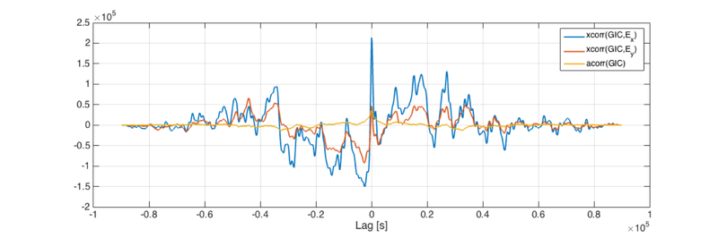

1-second electric field measurements
------------------------------------

From [http://www.kakioka-jma.go.jp/obsdata/metadata/en](http://www.kakioka-jma.go.jp/obsdata/metadata/en) on 07/01/2017

~~~~ {.codeinput}
figure(2);clf;hold on;box on;grid on;
    plot(tE,E);
    xlabel('Days since 2006-12-13');
    ylabel('[mV/km]')
    legend('E_x','E_y','Location','NorthWest');
    title('Memambetsu Magnetic Observatory (MMB)');
    figconfig
    if png,print('-dpng','./figures/html/main_plot_2_E.png');end
~~~~

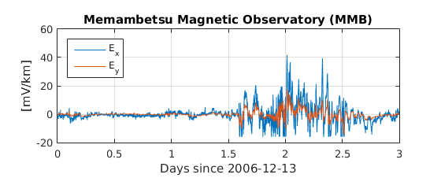

1-second GIC measurements
-------------------------

From S. Watari via email. Data file has two columns, one is 1-second data and the other is 1-second data low-pass-filtered at @ 1 Hz (no additional details are given for filter). Results are not dependent on which column was used.

This is the original data after converting from JST to UT. Note that there appears to be a \~66-second shift in this data that clearly appears when the IRF is computed. The computed GIC response to an impulse in E or B at time zero has a peak at -66 seconds. This shift was made before all transfer function calculations.

~~~~ {.codeinput}
figure(3);clf;hold on;box on;grid on;
    plot(tGIC,GIC(:,1));
    plot(tGIC,GIC(:,2));
    set(gca,'XLim',[0 3])
    xlabel('Days since 2006-12-13');
    ylabel('[A]');
    legend('GIC @ 1 Hz','GIC @ 1 Hz; LPF @ 1 Hz','Location','SouthWest');
    title('Memambetsu 187 kV substation');
    figconfig
    if png,print('-dpng','./figures/html/main_plot_3_GIC.png');end
~~~~

Prediction of Ex using B as driver
----------------------------------

Using Time Domain (TD) and Frequency Domain (FD) method.

Time domain method uses 60\*5 causal and 60\*5 acausal lag values.

~~~~ {.codeinput}
figure(4);clf;hold on;box on;grid on;
    plot(tE,E(:,1));
    plot(tE,Ep_TD(:,1));
    plot(tE,Ep_FD(:,1));
    xlabel('Days since 2006-12-13');
    ylabel('E_x [mV/km]');
    legend('Measured','TD','FD','Location','NorthWest');
    title('B driver');
    figconfig
    if png,print('-dpng','./figures/html/main_plot_4_Expredicted_w_B.png');end
~~~~

Prediction of Ey using B as driver
----------------------------------

Time domain method uses 60\*5 causal and 60\*5 acausal lag values.

~~~~ {.codeinput}
figure(5);clf;hold on;box on;grid on;
    plot(tE,E(:,2));
    plot(tE,Ep_TD(:,2));
    plot(tE,Ep_FD(:,2));
    xlabel('Days since 2006-12-13');
    ylabel('E_y [mV/km]');
    title('B driver');
    legend('Measured','TD','FD','Location','SouthWest');
    figconfig
    if png,print('-dpng','./figures/html/main_plot_5_Eypredicted_w_B.png');end
~~~~

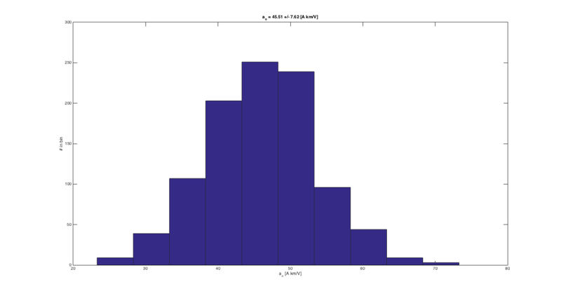

Prediction of GIC using B as driver
-----------------------------------

Time domain method uses 60\*5 causal and 60\*5 acausal lag values. Prediction is for GIC LPF @ 1 Hz. Very similar results for raw data. The *Const* lines correspond to the models

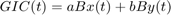

and

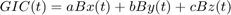

where the constants are determined using ordinary least squares regression. It is curious that addition of the Bz compontent to the model improves the predictions significantly. It is also unexpected that predictions of GIC given **B** are so much better than predictions of GIC given **E** (next figure) because **E** is more directly related to GIC. That is, in terms of transfer fucntions, and 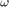 = angular frequency,

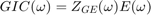

and

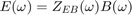

so

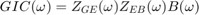

~~~~ {.codeinput}
figure(6);clf;hold on;box on;grid on;
    plot(tGIC,GIC(:,2));
    plot(tGIC,GICp3_TD(:,2));
    plot(tGIC,GICp3_FD(:,2));
    plot(tGIC,GICp3_TD0(:,2));
    plot(tGIC,GICp3_TD03(:,2));
    xlabel('Days since 2006-12-13');
    ylabel('GIC [A]');
    legend('Measured',...
        sprintf('TD; PE = %.2f',pe_nonflag(GIC(:,2),GICp3_TD(:,2))),...
        sprintf('FD; PE = %.2f',pe_nonflag(GIC(:,2),GICp3_FD(:,2))),...
        sprintf('Const x,y input; PE = %.2f',pe_nonflag(GIC(:,2),GICp3_TD0(:,2))),...
        sprintf('Const x,y,z input; PE = %.2f',pe_nonflag(GIC(:,2),GICp3_TD03(:,2))),...
        'Location','SouthWest');
    title('B driver');
    legend boxoff
    figconfig
    if png,print('-dpng','./figures/html/main_plot_6_GICpredicted_w_B');end
~~~~

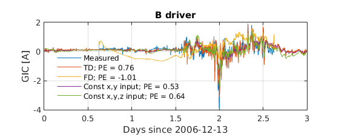

Prediction of GIC using E as driver
-----------------------------------

Time domain method uses 60\*5 causal and 60\*5 acausal lag values. Prediction is for GIC LPF @ 1 Hz. Very similar results for raw data. The "Const" line correspond to the model GIC(t) = a\*Ex(t) + b\*Ey(t) where a and b were determined by ordinary least squares regression. Note that the computed values of a and b were a = 0.45 and b = -0.63. The negative sign on b is unexpected given that when the model GIC(w) = A(w)\*Ex(w) + B(w)\*Ey(w) is used, the impulse response associated with A(w) and B(w) are generally positive. The impulse responses are shown later.

~~~~ {.codeinput}
figure(7);clf;hold on;box on;grid on;
    plot(tGIC,GIC(:,2));
    plot(tGIC,GICp2_TD(:,2));
    plot(tGIC,GICp2_FD(:,2));
    plot(tGIC,GICp2_TD0(:,2));
    xlabel('Days since 2006-12-13');
    ylabel('GIC [A]');
    legend('Measured',...
        sprintf('TD; PE = %.2f',pe_nonflag(GIC(:,2),GICp2_TD(:,2))),...
        sprintf('FD; PE = %.2f',pe_nonflag(GIC(:,2),GICp2_FD(:,2))),...
        sprintf('Const; PE = %.2f',pe_nonflag(GIC(:,2),GICp2_TD0(:,2))),...
        'Location','SouthWest');
    title('E driver');
    figconfig
    if png,print('-dpng','./figures/html/main_plot_7_GICpredicted_w_E');end
~~~~

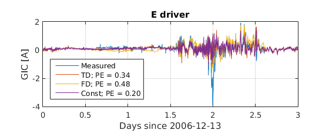

Response of Ex to impulse in By
-------------------------------

~~~~ {.codeinput}
figure(8);clf;hold on;box on;grid on;
    plot(t_TD,H_TD(:,2));
    plot(t_FD,H_FD(:,2));
    xlabel('Time [s] since 1 nT impulse in B_y');
    ylabel('E_x [mV/km]');
    legend('TD','FD');
    set(gca,'XLim',[-60,60]);
    figconfig
    if png,print('-dpng','./figures/html/main_plot_8_E_IRF_to_By.png');end
~~~~

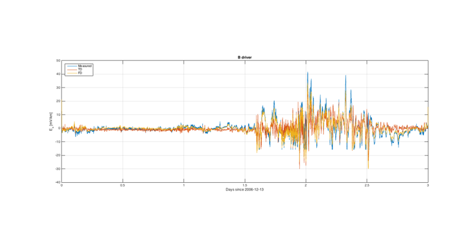

Response of Ey to impulse in Bx
-------------------------------

~~~~ {.codeinput}
figure(9);clf;hold on;box on;grid on;
    plot(t_TD,H_TD(:,3));
    plot(t_FD,H_FD(:,3));
    xlabel('Time [s] since 1 nT impulse in B_x');
    ylabel('E_y [mV/km]');
    legend('TD','FD');
    set(gca,'XLim',[-60,60]);
    figconfig
    if png,print('-dpng','./figures/html/main_plot_9_E_IRF_to_Bx.png');end
~~~~

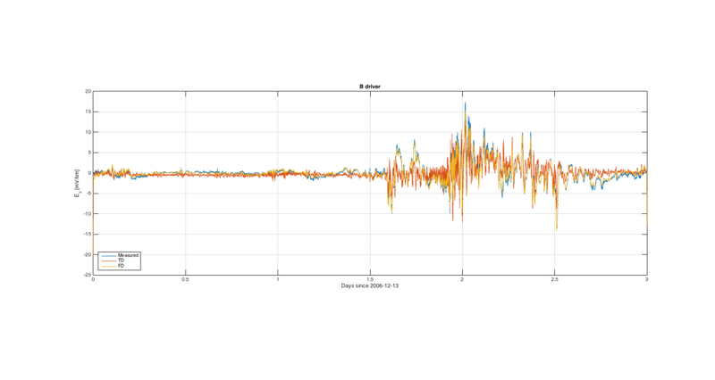

Response of GIC to impulse in Ex
--------------------------------

The red dot for a is the value computed using ordinary linear least squares regression on GIC(t) = aEx(t) + bEy(t). The value plotted is *a*/4 so the features of the IRFs are easier to see. The sign of *a* is positive and consistent with the IRF, and the magnitude of *a* relative to the peak of the IRF can be expained by the fact that *a* represents an integral of the IRF.

~~~~ {.codeinput}
figure(10);clf;hold on;box on;grid on;
    plot(t2_TD,H2_TD(:,3));
    plot(t2_FD,H2_FD(:,3));
    plot(0,aE/4,'r.','MarkerSize',30);
    xlabel('Time [s] since 1 mV/km impulse in E_x');
    ylabel('GIC [A]');
    legend('TD','FD','a/4');
    set(gca,'XLim',[-120,120]);
    figconfig
    if png,print('-dpng','./figures/html/main_plot_10_GIC_IRF_to_Ex.png');end
~~~~

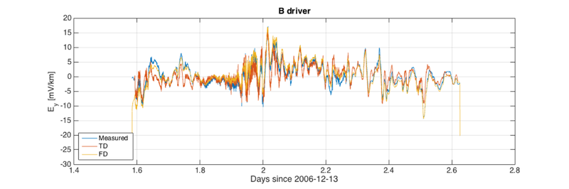

Response of GIC to impulse in Ey
--------------------------------

The red dot for b is the value computed using ordinary linear least squares regression on GIC(t) = aEx(t) + bEy(t). *b*/2 is shown so the features of the IRFs are easier to see. Note that this IRF has the feature that it overshoots the zero line. This feature cannot be produced by (first-order) LR or RC circuit model alone. This is a second-order effect. Also note that the sign of *b* is not consistent with the sign of the peak of the IRF.

~~~~ {.codeinput}
figure(11);clf;hold on;box on;grid on;
    plot(t2_TD,H2_TD(:,2));
    plot(t2_FD,H2_FD(:,2));
    plot(0,bE/2,'r.','MarkerSize',30);
    xlabel('Time [s] since 1 mV/km impulse in E_y');
    ylabel('GIC [A]');
    legend('TD','FD');
    legend('TD','FD','b/2');
    set(gca,'XLim',[-120,120]);
    figconfig
    if png,print('-dpng','./figures/html/main_plot_11_GIC_IRF_to_Ey.png');end
~~~~

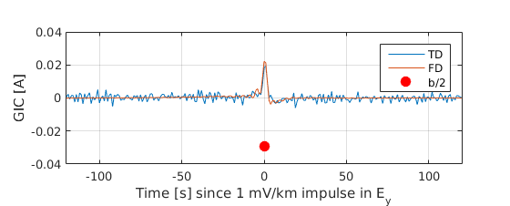

Response of GIC to impulse in Ey - Zoom
---------------------------------------

Same as previous plot with with *b* not shown to reveal undershoot detail in IRF.

~~~~ {.codeinput}
figure(11);clf;hold on;box on;grid on;
    plot(t2_TD,H2_TD(:,2));
    plot(t2_FD,H2_FD(:,2));
    %plot(0,bE/2,'r.','MarkerSize',30);
    xlabel('Time [s] since 1 mV/km impulse in E_y');
    ylabel('GIC [A]');
    legend('TD','FD');
    legend('TD','FD');
    set(gca,'XLim',[-120,120]);
    figconfig
    if png,print('-dpng','./figures/html/main_plot_11_GIC_IRF_to_Ey_2.png');end
~~~~

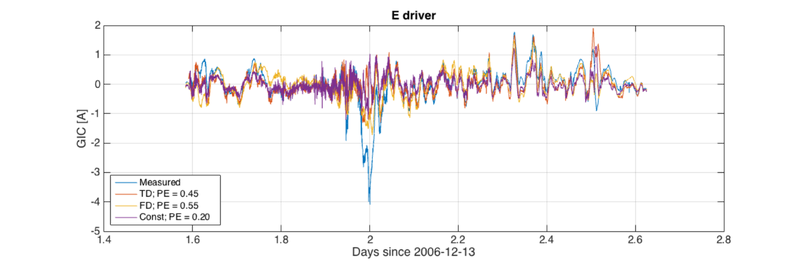

Response of GIC to impulse in Bx
--------------------------------

The red dot for a is the value computed using ordinary linear least squares regression on GIC(t) = aBx(t) + bBy(t).

~~~~ {.codeinput}
figure(12);clf;hold on;box on;grid on;
    plot(t3_TD,H3_TD(:,3));
    plot(t3_FD,H3_FD(:,3));
    plot(0,aB,'r.','MarkerSize',30);
    xlabel('Time [s] since 1 nT impulse in B_x');
    ylabel('GIC [A]');
    legend('TD','FD','a');
    set(gca,'XLim',[-120,120]);
    figconfig
    if png,print('-dpng','./figures/html/main_plot_12_GIC_IRF_to_Bx.png');end
~~~~

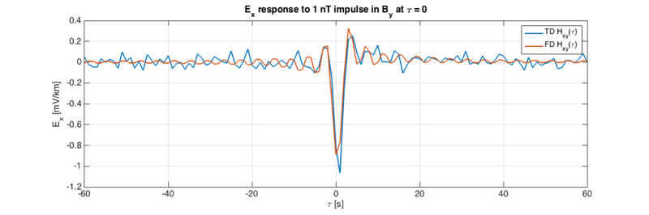

Response of GIC to impulse in By
--------------------------------

The red dot for b is the value computed using ordinary linear least squares regression on GIC(t) = aBx(t) + bBy(t).

~~~~ {.codeinput}
figure(13);clf;hold on;box on;grid on;
    plot(t3_TD,H3_TD(:,2));
    plot(t3_FD,H3_FD(:,2));
    plot(0,bE,'r.','MarkerSize',30);
    xlabel('Time [s] since nT impulse in B_y');
    ylabel('GIC [A]');
    legend('TD','FD','b');
    set(gca,'XLim',[-120,120]);
    figconfig
    if png,print('-dpng','./figures/html/main_plot_13_GIC_IRF_to_By.png');end

if (0)
tl = [-100:100];
for i = tl
    j = i-tl(1)+1;
    [T,X] = time_delay(GIC(:,2),E,1,i);
    LIN = basic_linear(X,T);
    xarv(j) = LIN.ARVtrain;
    a(j) = LIN.Weights(1);
    b(j) = LIN.Weights(2);
end

figure(14);clf;hold on;box on;grid on;
    plot(tl,a,'LineWidth',2);
    plot(tl,b,'LineWidth',2);
    plot(tl,(1-xarv)/10,'LineWidth',2);
    xlabel('Lag');
    ylabel('[A km/mV]');
    legend('a','b','pe/10');
end
~~~~

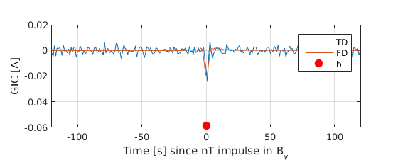

[Published with MATLAB® R2015a](http://www.mathworks.com/products/matlab/)
